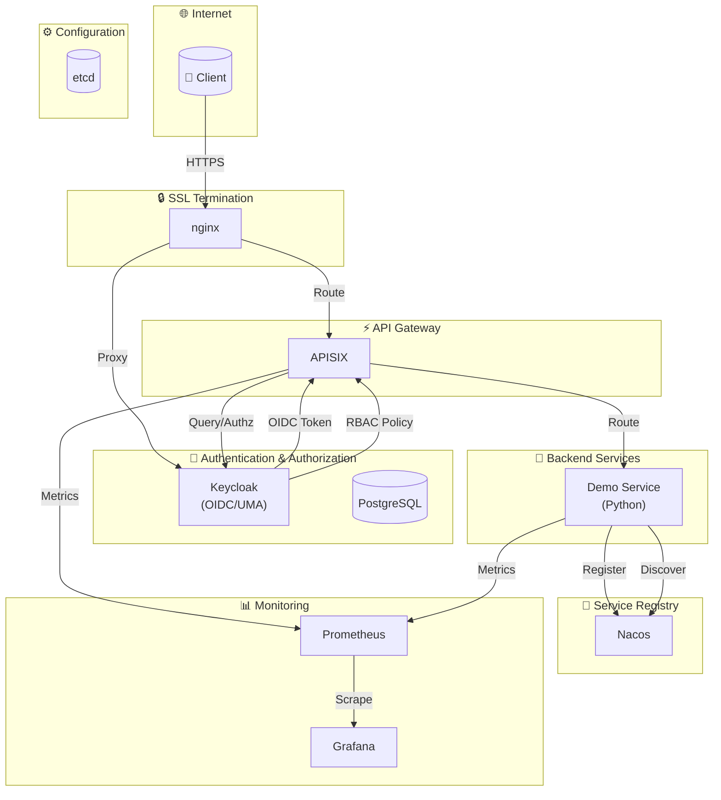

# Personal AI Infrastructure (PAI)

TL;DR;

```bash
docker compose up -d
```

## 架构图



## 自动初始化 (kcadm + APISIX Admin API)

启动时自动配置，无需手动操作：

1. **Keycloak 配置** (via keycloak-init.sh)
   - Realm: `pai_realm`
   - Client: `pai-client` (confidential, OIDC client_secret_post)
   - Roles: `admin`, `user`, `guest`
   - Users: `testuser/testPass@123!` (user role), `admin/changeit` (admin role)

2. **APISIX 配置** (via apisix-init.sh)
   - Consumer: `hmac-consumer` with HMAC credentials
   - Routes:
     - `demo-api-route` (`/demo/api/*` → `/api/v1/*`)
     - `demo-openapi-route` (`/demo/openapi/*` → `/api/v1/*`, hmac-auth + limit-req)
     - `demo-users-route` (`/demo/users/*` → `/api/v1/*`, OIDC + Casbin)
     - `demo-admin-route` (`/demo/admin/*` → `/api/v1/*`, OIDC + Casbin admin-only)

## API Routes

| Route | Auth | Upstream |
|-------|------|----------|
| `/demo/api/*` | None (proxy-rewrite only) | `/api/v1/*` |
| `/demo/openapi/*` | hmac-auth + limit-req | `/api/v1/*` |
| `/demo/users/*` | openid-connect + authz-casbin | `/api/v1/*` |
| `/demo/admin/*` | openid-connect + authz-casbin (admin only) | `/api/v1/*` |
| `/demo/keycloak/*` | authz-keycloak (UMA, lazy_load_paths, http_method_as_scope) | `/api/v1/*` |

## Demo Service Endpoints

- `GET /` - Health check
- `GET /health` - Health check
- `GET /api/v1/echo?msg=xxx` - Echo endpoint

## Testing with Script

### 获取 HMAC 凭据

HMAC 凭据由 apisix-init.sh 自动生成，查看凭据：

```bash
docker compose logs apisix-init2>&1 | grep -A2 "HMAC credentials"
```

输出示例：
```
HMAC credentials:
  key_id: 0610399cc2cb2c7066b93720f58bb10c
  secret_key: pqDUQYKs/Zyj5icfnXRR/t+hoUpw17g0QJ/trHzOzIo=
```

### 运行测试

```bash
python3 testcases.py \
  --base-url https://api.example.com \
  --hmac-key-id 0610399cc2cb2c7066b93720f58bb10c \
  --hmac-secret-key pqDUQYKs/Zyj5icfnXRR/t+hoUpw17g0QJ/trHzOzIo= \
  --kc-server https://keycloak.example.com \
  --kc-client-secret eest0AKdpyWZFNUqT4ST2fSrZsDL027k
```

## Plugins Reference

- [authz-keycloak](https://apisix.apache.org/zh/docs/apisix/plugins/authz-keycloak/) - OIDC/UMA authentication
- [authz-casbin](https://apisix.apache.org/zh/docs/apisix/plugins/authz-casbin/) - RBAC authorization
- [hmac-auth](https://apisix.apache.org/zh/docs/apisix/plugins/hmac-auth/) - HMAC signature verification